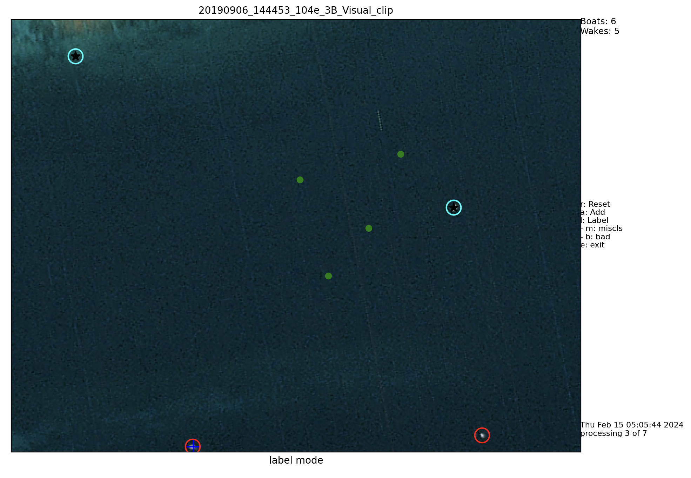

# TIF Processor lets go

Simple labeler and new detection adder to tiff files.




## Table of Contents

- [Installation](#installation)
- [Usage](#usage)
- [Contributing](#contributing)
- [License](#license)

## Installation

1. Clone the repository:

   ```shell
   git clone https://github.com/swricci/labeler.git
   ```

### Conda Environment

This project requires a conda environment to run. To set up the environment, follow these steps:

1. Install [Anaconda](https://www.anaconda.com/products/individual) or [Miniconda](https://docs.conda.io/en/latest/miniconda.html) if you haven't already.

2. If you have `conda` installed, make sure to update it:

```bash
conda update conda
```

3. Create a new conda environment using the provided `environment.yml` file:

```bash
    conda env create -n labeler_env python=3.12
```

4. Activate the environment:

```bash
    conda activate labeler_env
```

5. Install dependencies:

```bash
    pip install -r requirements.txt
```

## Usage

1. Create a `input.toml` file to specify your database and tif path. An example is shown in `input.toml.example`. You can copy paste it and change the name to `input.toml` and add your specific paths.

```toml
# user paths
tiff_directory = "your/database/path"
detection_database = "your/detections/file.csv"
```


2. Execute the script:

```bash
python lets_go.py
```

### Key Options

The following table outlines the key options available in the GUI:

| Key | Function                    | Description                                       |
| --- | --------------------------- | ------------------------------------------------- |
| `a` | New Detection Addition Mode | Enter the mode to add new detections.             |
| `l` | Labeling Mode               | Switch to labeling mode.                          |
|     | - `m`                       | Label as misclassified.                           |
|     | - `b`                       | Label as bad classification.                      |
| `r` | Refresh                     | Refresh the current view or state.                |
| `e` | Exit                        | Exit the application or close the current window. |

### Note

- To enter a sub-mode in labeling mode, first press `l` then `m` or `b`.
- Press `r` to refresh if the screen appears frozen or does not update.

## Contributing

The tool is too specific. You can't contribute.

## License

This project is released under the Unlicense.
